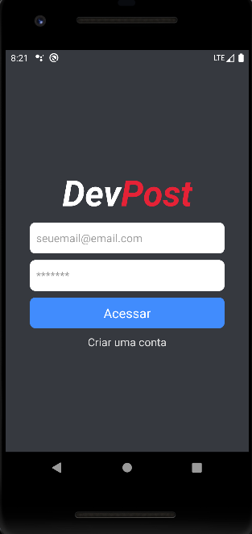
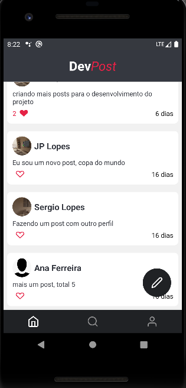

# devpostApp

# Descripition 

The **devpostApp** is a project developed during **Sujeito Programador** classes. The purpose of the application is to make a Social App, so then the users can create the account, once logged in, the users are able to send a new post, or like the posts. The application is similiar to the "Facebook" consedering the post features.

**Sujeito Programador:**
https://sujeitoprogramador.com/

## 🛠️ Features

- Create an account
- Login/Logout
- List the posts from all users
- Like/Unlike a post
- Make a post
- Edit the profile
- Image upload
- Search for users by the user's name

## 📡 Technologies 

 

  

  

  

## 🔎 Project Status 

## 🌍 Find me

- [Linkedin](https://www.linkedin.com/in/joao-lopes-071026198/)
